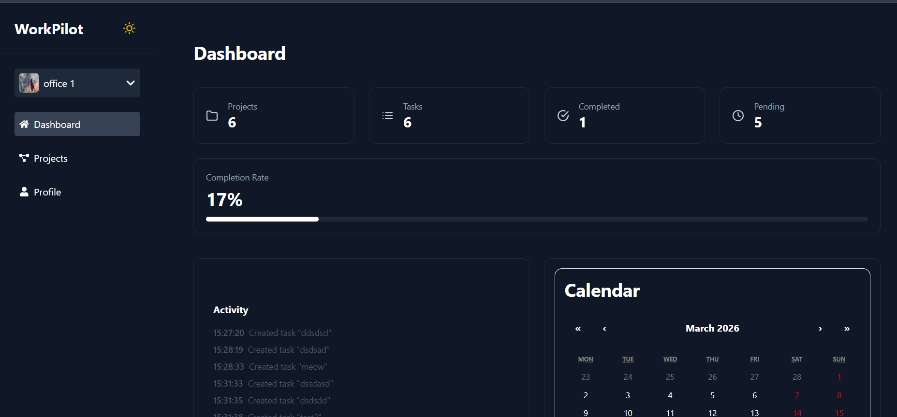
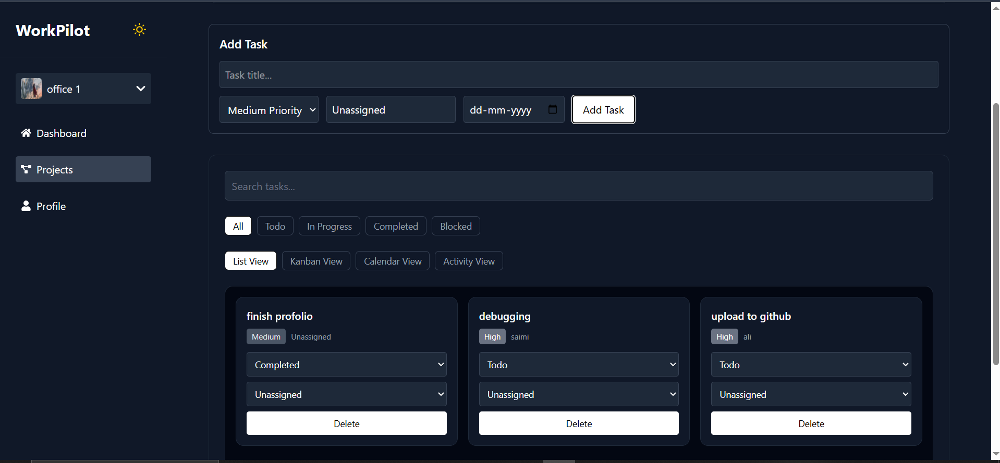
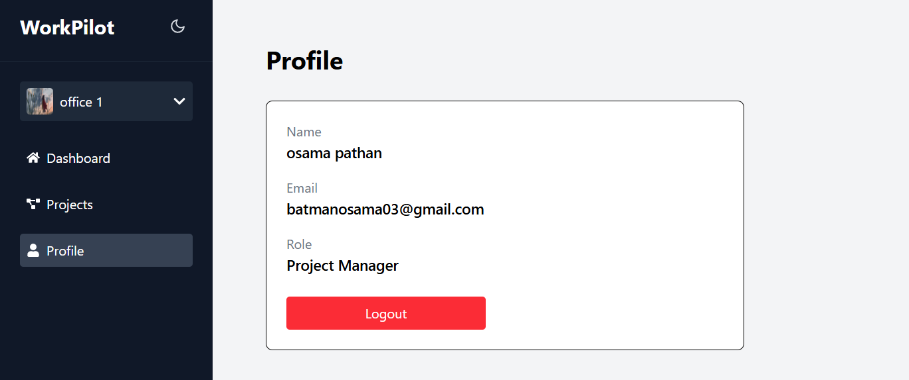

## WorkPilot – Project & Task Management App

## About

WorkPilot is a modern project and task management web application built using React and Redux Toolkit.

The app allows users to create organizations (workspaces), manage projects inside them, and handle tasks with multiple views like list, kanban board, calendar, and activity tracking.

It focuses on real-world frontend architecture, state management, and scalable UI design. Authentication is handled using Clerk, and user-specific data is persisted using LocalStorage.

This project simulates a real SaaS productivity tool and will continue to evolve with more advanced features.

---

## Features

User authentication with Clerk

Create and switch between organizations (workspaces)

Create, manage, and delete projects

Task management with:
- Status (Todo, In Progress, Completed, Blocked)
- Priority levels
- Assignee support
- Due dates

Multiple task views:
- List view
- Kanban board
- Calendar view
- Activity feed

Search and filter tasks/projects

Dashboard with real-time stats:
- Total projects
- Total tasks
- Completed tasks
- Pending tasks
- Completion rate

Persistent state using LocalStorage (user-specific)

Dark / Light mode support

Responsive UI for all devices

---

## Project Structure / Components

App: Main routing system

DashboardLayout: Protected layout wrapper

ProtectedRoute: Auth-based route protection

Projects Page: Project creation & filtering

ProjectDetails Page:
- Task creation
- Task filtering
- Multiple views (list, kanban, calendar, activity)

Dashboard:
- Stats cards
- Activity feed
- Calendar preview

Profile:
- User info
- Logout

Redux Slices:
- projectSlice
- taskSlice
- organizationSlice
- activitySlice

Components:
- ProjectCard
- TaskCard
- KanbanBoard
- CalendarView
- ActivityFeed
- SearchBar

Context:
- ThemeContext
- AuthContext (legacy support)

---

## Screenshots

### Dashboard

### Projects

### Task View

---

## Technologies Used

React JS  
Redux Toolkit  
React Router DOM  
Clerk Authentication  
Tailwind CSS  
LocalStorage API  
Vite  

---

## Learning Outcome

Understanding global state management using Redux Toolkit

Implementing multi-view task systems (Kanban, Calendar, List)

Managing user-specific data persistence

Handling authentication using Clerk

Designing scalable frontend architecture

Building real-world dashboard UI

Fixing state persistence and filtering issues

---

## Future Upgrades

Admin panel for organization management

Assign projects and tasks to different users

Real-time collaboration (multi-user)

Backend integration (Node.js / Firebase)

Notifications system

File attachments in tasks

Advanced analytics dashboard

---

## Notes

This is a frontend-focused project.

Data persistence is handled using LocalStorage (no backend).

Clerk is used for authentication only.

The project is designed to simulate a real-world SaaS product and will be upgraded further.
